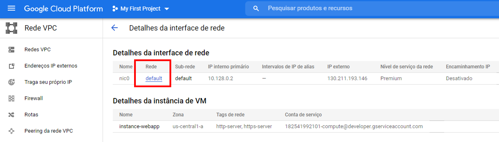

# Tutorial Deploy na Google Cloud Platform

1. Abrir uma conta na GCP - Veja o tutorial `CriarContaGoogleCloudPlatform-2021.pdf` disponibilizado antes da aula.

2. Criar uma VM (instância) Ubuntu-20.04 no Google Compute Engine


Caso seja necessário, clique em Ativar.


Aguarde alguns instantes e você será redirecionado para:


Clique em `Criar Instância`. Preencha o `Nome`, selecione o `Tipo de máquina` para `e2-micro (2 vCPU e 1GB de memória)`


Em `Disco de Inicialização`, clique em Alterar.


Selecione o `Ubuntu` e depois `Ubuntu 20.04 LTS`, por fim, altere o `tamanho do disco` para 30.


Em `Firewall`, marcar as caixas `Permitir tráfego HTTP` e `Permitir tráfego HTTPS`;


Por fim, clique em `Criar`. Aguarde a finalização do processo, pode demorar alguns minutos.


Após o termino da criação, clique em `Ocultar Painel de Informações`.

3. Liberar a porta `8501` (streamlit)


Clique em `Mais ações`. O 3 pontinhos indicados na imagem abaixo. Após clique em `Ver detalhes da rede`.


Em `Detalhes da interface de rede`, clicar no valor `default` no campo `Rede`;




Em `Regras de Firewall` clique em `default-allow-https`.

 

Clique em `Editar`, conforme ilustrado na imagem abaixo.

 


Em `Protocoloas e porta` no campo `tcp`, digite as portas: 443, 8501 e clicar em `SALVAR`;

 


**Voltar para a tela das VMs, clicando no `Menu de navegação` > ` Compute Engine` > `Instância de VM`.**


4. Abrir um SSH (terminal) para configurar e rodar a aplicação

Em `Conectar` clique na seta e depois em `Abrir na janela do navegador`;


Aguarde enquanto o terminal abra corretamente.


Na janela que o terminal estiver aberto, digite:

```
git clone https://github.com/dinomagri/analise-sentimento.git  analise-sentimento
```

Depois de finalizado, digite o comando:

```
cd analise-sentimento
```

Por fim, execute o script `deploy_gcp.sh`


```
bash deploy_gcp.sh
```

Após alguns minutos uma URL será gerada, copie e cole a URL em uma nova janela do navegador. Utilize a URL chamada External Link.


5. Desligar e remover a VM

**Caso não utilize mais a instancia, desligue e remova a VM para não ocasionar em CUSTOS.**

Selecione a instancia e depois clique nos `3 pontinhos` e selecione a operação de `PARAR` (ainda pode ocasionar custos de armazenamento) ou `Excluir`.


Pronto! Analisador de Sentimento implantado :)